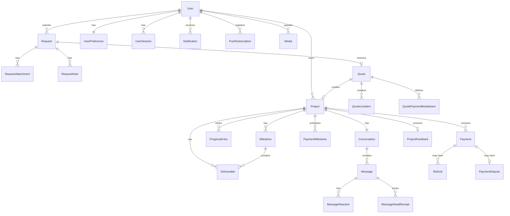

# Database Schema Documentation

## Overview

Nestlancer uses PostgreSQL 16 as its primary database with Prisma 5.x ORM. The schema is organized by domain and follows a read/write split architecture (ADR-005).

## Entity Relationship Diagram

## Domain Models

### User Domain
| Model | Description | Key Fields |
|-------|-------------|------------|
| `User` | Platform user | id, email (unique), firstName, lastName, role, status, emailVerified, twoFactorEnabled |
| `UserPreference` | User settings (1:1) | notifications (JSONB), privacy (JSONB), theme |
| `UserSession` | Active sessions | ipAddress, userAgent, lastActiveAt, expiresAt, isActive |
| `UserActivity` | Activity log | action, metadata (JSONB), ipAddress |

### Authentication Domain
| Model | Description | Key Fields |
|-------|-------------|------------|
| `LoginAttempt` | Login audit trail | email, ipAddress, success, failureReason |
| `RefreshToken` | JWT refresh tokens | token (hashed, unique), expiresAt, revokedAt, family (UUID) |
| `EmailVerificationToken` | Email verification | token (unique), expiresAt (24h), usedAt |
| `PasswordResetToken` | Password reset | token (unique), expiresAt (1h), usedAt |

### Project Domain
| Model | Description | Key Fields |
|-------|-------------|------------|
| `Project` | Active projects | title, status, startDate, totalAmount (Decimal), completionPercentage |
| `ProjectFeedback` | Client feedback (1:1) | rating (1-5), testimonial, isPublic, approvedByAdmin |
| `ProjectTemplate` | Reusable templates | name, defaultMilestones (JSONB) |

### Request Domain
| Model | Description | Key Fields |
|-------|-------------|------------|
| `Request` | Service requests | title, category, budgetRange (JSONB), timeline, status, priority |
| `RequestAttachment` | File attachments | requestId, mediaId |
| `RequestNote` | Admin notes | content, createdBy |
| `RequestStatusHistory` | Status audit trail | fromStatus, toStatus, changedBy, note |

### Quote Domain
| Model | Description | Key Fields |
|-------|-------------|------------|
| `Quote` | Proposals | totalAmount (Decimal), validUntil, status, scope, terms, version |
| `QuoteLineItem` | Line items | description, quantity, unitPrice (Decimal), total (Decimal), order |
| `QuotePaymentBreakdown` | Payment schedule | type, amount (Decimal), percentage, dueDate, order |

### Progress Domain
| Model | Description | Key Fields |
|-------|-------------|------------|
| `ProgressEntry` | Timeline entries | type, title, notifyClient, visibility |
| `Milestone` | Project milestones | name, startDate, endDate, status, order |
| `Deliverable` | Work deliverables | title, fileUrl, mediaId, status, version |

### Payment Domain
| Model | Description | Key Fields |
|-------|-------------|------------|
| `Payment` | Payment records | amount (Decimal, paise), status, type, razorpayPaymentId, method |
| `PaymentIntent` | Razorpay orders | razorpayOrderId (unique), idempotencyKey (unique), expiresAt |
| `PaymentMilestone` | Payment schedule | type, amount (Decimal), dueDate, status, order |
| `PaymentDispute` | Disputes | reason, status, resolution, evidence (JSONB) |
| `Refund` | Refund records | amount (Decimal), reason, razorpayRefundId, status |

### Messaging Domain
| Model | Description | Key Fields |
|-------|-------------|------------|
| `Conversation` | Project conversations (1:1 with Project) | projectId (unique), participants, lastMessageAt |
| `Message` | Chat messages | content (encrypted), type, replyToId (self-ref), deletedAt |
| `MessageReaction` | Emoji reactions | emoji, unique(messageId, userId, emoji) |
| `MessageReadReceipt` | Read tracking | readAt, unique(messageId, userId) |

### Notification Domain
| Model | Description | Key Fields |
|-------|-------------|------------|
| `Notification` | User notifications | type, category, title, message, priority, readAt, channels |
| `NotificationPreference` | Channel preferences (1:1) | channels (JSONB), quietHoursStart/End |
| `PushSubscription` | Web Push subscriptions | endpoint, p256dh, auth, deviceInfo (JSONB) |

### Media Domain
| Model | Description | Key Fields |
|-------|-------------|------------|
| `Media` | File metadata | filename, mimeType, size (BigInt), context, bucket, storageKey, status |
| `MediaVersion` | File versions | version, storageKey, size |
| `MediaShareLink` | Temporary share links | token (unique), expiresAt, maxDownloads |
| `ChunkedUploadSession` | Large file uploads | totalChunks, uploadedChunks, status, expiresAt |

### Portfolio Domain
| Model | Description | Key Fields |
|-------|-------------|------------|
| `PortfolioItem` | Showcase items | title, slug (unique), status, featured, displayOrder, viewCount |
| `PortfolioCategory` | Categories | name, slug (unique), displayOrder |
| `PortfolioTag` | Tags | name (unique), slug (unique) |

### Blog Domain
| Model | Description | Key Fields |
|-------|-------------|------------|
| `Post` | Blog posts | title, slug (unique), content, status, scheduledAt, publishedAt |
| `Comment` | Post comments | content, parentId (self-ref for threading), status |
| `BlogCategory` | Blog categories | name, slug (unique), postCount |
| `Bookmark` | User bookmarks | unique(userId, postId) |

### Infrastructure Models
| Model | Description | Key Fields |
|-------|-------------|------------|
| `OutboxEvent` | Transactional outbox | aggregateType, eventType, payload (JSONB), status, retryCount |
| `IdempotencyKey` | Dedup keys | key (unique, UUID), requestHash, responseBody (JSONB), expiresAt |
| `AuditLog` | Audit trail | action, resourceType, resourceId, changes (JSONB), append-only |
| `SystemConfig` | System settings | key (unique), value (JSONB), category |
| `FeatureFlag` | Feature toggles | flag (unique), enabled, rolloutPercentage |

## Currency Convention

All monetary amounts are stored as `Decimal(12,2)` in **paise** (INR smallest unit):
- ₹1,500.00 = `150000` paise
- Always use `money.util.ts` for conversions
